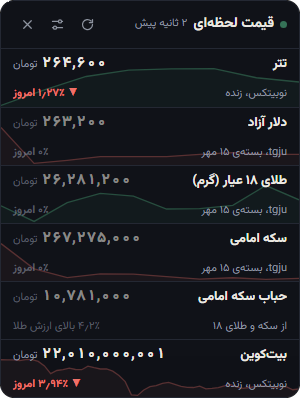
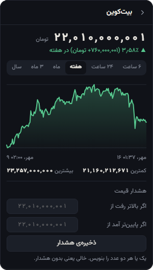
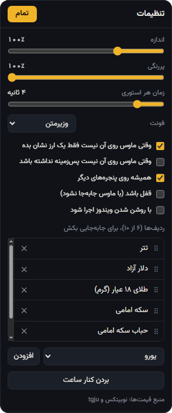
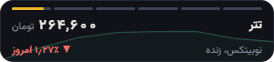

[English](README.md) · **فارسی**

<div dir="rtl">

# ویجت قیمت ورنا

قیمت لحظه‌ای تتر، دلار، طلا، سکه و رمزارزها به تومان، روی دسکتاپ ویندوز.

</div>

<p align="center">
  
  &nbsp;
  
  &nbsp;
  
</p>
<p align="center">
  
</p>

<div dir="rtl">

- وقتی کار می‌کنی یک خط می‌شود و با آمدن ماوس باز می‌شود
- نمودار از ۶ ساعت تا ۵ سال، هشدار قیمت با اعلان ویندوز
- حباب سکه و فاصله‌ی تتر با دلار، حساب‌شده و زنده
- شش فونت فارسی، حالت بدون پس‌زمینه، آیکن کنار ساعت، اجرا با ویندوز

## دانلود

فایل `VernaPriceWidget.exe` را از [آخرین ریلیز](https://github.com/VernaTeam/verna-price-widget/releases/latest) بگیر و اجرا کن.
ویندوز ۱۰ یا ۱۱ با WebView2 لازم است، و اینترنت مستقیم داخل ایران.

## اجرا از سورس

</div>

```bash
pip install -r requirements.txt
python run.pyw
```

<div dir="rtl">

ساخت exe با `pyinstaller --noconfirm --clean VernaPriceWidget.spec` و تست‌ها با `python -m unittest`.

## منابع

قیمت‌ها از API عمومی [نوبیتکس](https://nobitex.ir) و [tgju](https://www.tgju.org) (غیررسمی).
فونت‌ها: وزیرمتن، شبنم، ساحل، صمیم، پرستو (صابر راستی‌کردار) و استعداد (امین عابدی)، همه با مجوز SIL Open Font License. فایل مجوز هر فونت کنارش در `ui/fonts/` است و مجوز MIT شامل فونت‌ها نمی‌شود.

MIT © 2026 Verna

</div>
